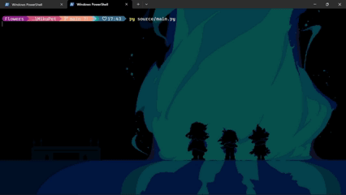
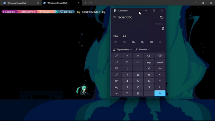

# 🌟 MikuPet - Your Desktop Diva Companion!

A virtual desktop pet inspired by Hatsune Miku. Always walk to the active window and you can drag her!

## 📸 Preview

<div align="center">
  
  
  
  
</div>

## Features

- ⭐ Follows the **active window** around your desktop.
- ⭐ **Drag** her around with your mouse
- ⭐ Respond to simple **text commands**
- ⭐ Super lightweight and made with love.

---

## 🔧 Quick setup installation

> [!NOTE]
> Works only on Windows (for now). Mac and Linux may come later!

To run **MikuPet** on your system, follow these simple steps:

1. 🐍 **Make sure Python is installed.**  
   - Python 3 is required (any modern version should work).
   - You can download it from [python.org](https://www.python.org/downloads/)

2. 📂 **Download the latest release**  
   - Go to the [Releases section](https://github.com/charleswiiflowers/MikuPet/releases) of this repository.
   - Download the `.zip` or `.tar.gz` file for the latest version.
   - Extract it to a folder of your choice.

3. ⚙️ **Install dependencies**  
   Open a terminal (or command prompt), navigate to the extracted folder, and run:

   ```bash
   pip install -r requirements.txt
   ```
4. 🏁 **Run the app**
   Simply double-click on `start.bat` to launch the app.
   A console window will open — this is where you can type commands to interact with Miku (for example, `miku bye` to exit).

## 🖱️ Usage

Using **MikuPet** is super simple:

1. Double-click on `start.bat` to launch the app.
2. Miku will appear on your desktop, floating and moving cutely.
3. A terminal window will open — this is your way to chat with Miku!

### 🗣️ Available Commands

You can type the following commands into the console:

| 🖥️ Command                | 🧵 Description                          |
|------------------------|--------------------------------------|
| `miku hello` or `hello`| **Miku will greet you warmly** 💙        |
| `miku bye` or `bye`    | **Closes MikuPet gracefully** 👋         |
| `how are you` *(variants)* | **Miku responds to your question** 🤖🎶<br>Accepted forms: `how are you`, `how are you?`, `miku how are you` |

More commands coming soon... maybe even little surprises! 🎁✨

---

## 🛠️ Built with

- 🐍 Python 3
- 🖥️ Tkinter
- 🎨 Pixel Art Sprites

## 🌱 Roadmap

- [ ] Miku speaks and sings at random moments.
- [ ] Mini desktop games.
- [ ] Feed Miku!
- [ ] More characters like **Teto, Rin and Len**!
- [ ] **AI and IoT integration!**

---

## 🌟 Credits

- 💗 Created with love by [Charles Flowers](https://charleswiiflowers.github.io/)
- ⚡ Assets by **BYP Studio** y **Chaim Videogames** for the game [Miku 'n pop](https://chaim-videogames.itch.io/mikun-pop). Source: [The VG Resource](https://www.spriters-resource.com/pc_computer/mikunpop/sheet/46493/)
- 🦀 Inspired by the Shimeji classic desktop pets. 

---

## 💘 Thank you for visiting!

Have fun chatting with your digital desktop diva 💫

> 🎶 Life is a melody you compose at your own tempo.
> Let **MikuPet** be your rhythm compation for every line of code. 🖥️✨
