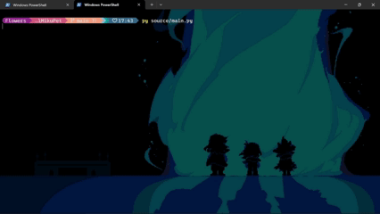
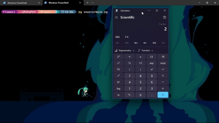

# 🎵 MikuPet - Your Desktop Diva Companion

A small virtual desktop companion inspired by Hatsune Miku.
She follows your active window, walks around your desktop, and keeps you company while you work or code.

## 📸 Preview

MikuPet in action:

<div align="center">
  
  
  
</div>

## Table of Contents

* [Features](#features)
* [Quick Setup](#quick-setup)
* [Usage](#usage)
* [Building from Source](#building-from-source)
* [Built With](#built-with)
* [Architecture](#architecture)
* [Contributing](#contributing)
* [Credits](#credits)

---

## ✨ Features

* Follows the active window around your desktop.
* Walks automatically across window boundaries.
* Drag Miku around with your mouse.
* Animated sprite system with customizable characters.
* Lightweight desktop companion built with Python.
* Modular architecture designed for future extensions.

---

## 🚀 Quick Setup

> [!NOTE]
> MikuPet currently supports Windows only.

The easiest way to use MikuPet is by downloading the latest release.

### 1. Download MikuPet

Go to the [Releases section](https://github.com/charleswiiflowers/MikuPet/releases) and download the latest `MikuPet.zip`.

Extract the contents anywhere on your computer.

The folder should contain:

```text
MikuPet.exe
assets/
data/
```

### 2. Run MikuPet

Execute:

```text
MikuPet.exe
```

MikuPet will appear on your desktop and start following your active window.

---

## Usage

After launching MikuPet, she will appear on your desktop and start her little desktop adventure:

* Miku will follow the active window.
* You can drag her around with your mouse.
* Her animations and behaviors are managed automatically.

More interaction features may be added in future versions.

---

## 🛠️ Building from Source

If you want to build MikuPet yourself, make sure you have Python 3 installed.

Install the required dependencies:

```bash
pip install -r requirements.txt
```

Then run the build script:

```powershell
.\scripts\build.ps1
```

The script will create the executable using PyInstaller.

The generated executable is designed to work with external folders:

```text
MikuPet.exe
assets/
data/
```

Assets and configuration files are intentionally kept outside the executable to make customization and future extensions easier.

---

## Built With

* Python 3
* Tkinter
* PyInstaller
* Pixel Art Sprites
* LibreSprite (for sprite editing and organization)

---

## 🧩 Architecture

MikuPet was rebuilt with a modular internal architecture.

The current version includes:

* Event-driven communication system.
* Engine update loop.
* Configurable systems.
* Character state management.
* Independent rendering and animation systems.
* External asset loading system.

The goal is to make MikuPet easier to extend with new behaviors, characters, and features.

---

## 🤝 Contributing

Contributions are welcome!

If you want to improve MikuPet, feel free to open an issue or submit a pull request.

The codebase documentation is still being improved. I hope to document the project in the future so contributing becomes easier for everyone.

All contributions will be reviewed before merging.

Some especially valuable contributions would be:

* Adding macOS support.
* Improving cross-platform compatibility.
* Adding new characters or animations.
* Improving internal systems.

Linux support is also planned, but will be worked on later.

---

## 💙 Credits

* Created with love by [Charles Flowers](https://charleswiiflowers.github.io/)

* Character assets by **BYP Studio** and **Chaim Videogames** for *Miku 'n Pop*.
  Source: [The VG Resource](https://www.spriters-resource.com/pc_computer/mikunpop/sheet/46493/)

* Inspired by classic desktop pets such as Shimeji.

---

## 🎵 Thank You

Thanks for checking out MikuPet!

I hope this little desktop companion brings some fun to your workspace and makes your coding sessions a little more enjoyable.

> Life is a melody you compose at your own tempo.
